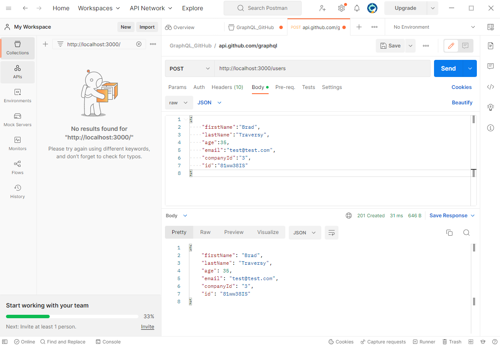
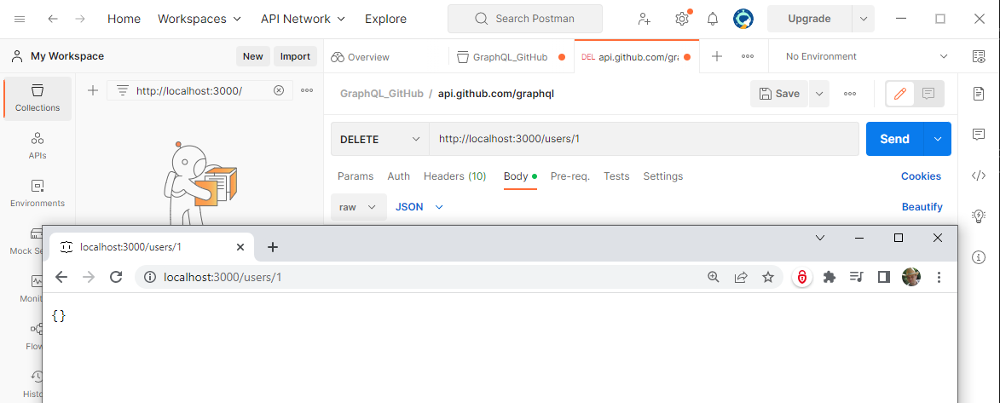

create the default folder for the project

```
mkdir jsonserver
```

create the nodejs server project 

```jsonserver>npm init
This utility will walk you through creating a package.json file.
It only covers the most common items, and tries to guess sensible defaults.

See `npm help init` for definitive documentation on these fields
and exactly what they do.

Use `npm install <pkg>` afterwards to install a package and
save it as a dependency in the package.json file.

Press ^C at any time to quit.
package name: (jsonserver)
version: (1.0.0)
description: fake REST API for testing
entry point: (index.js)
test command:
git repository:
keywords: catafest,REST,fake,API,server,json,javascript
author: catafest
license: (ISC)
About to write to F:\jsonserver\package.json:

{
  "name": "jsonserver",
  "version": "1.0.0",
  "description": "fake REST API for testing ",
  "main": "index.js",
  "scripts": {
    "test": "echo \"Error: no test specified\" && exit 1"
  },
  "keywords": [
    "catafest",
    "REST",
    "fake",
    "API",
    "server",
    "json",
    "javascript"
  ],
  "author": "catafest",
  "license": "ISC"
}

Is this OK? (yes) yes ```

Install the json-server package

```
jsonserver>npm --save json-server
```
create a json file db.json

run the server with the following command
```
jsonserver>npm run json:server

> jsonserver@1.0.0 json:server
> json-server --watch db.json


  \{^_^}/ hi!

  Loading db.json
  Done

  Resources
  http://localhost:3000/users
  http://localhost:3000/companies

  Home
  http://localhost:3000

  Type s + enter at any time to create a snapshot of the database
  Watching...
```

I can change the URL of this server to perform these tasks:
 - get a single company
 - get a list of companies
 - filter companies by name
 - pagination and limit
 - sorting
 - users age range
 - full text search

I can test with postman tool the json response:



I can delete from json with postman tool:

